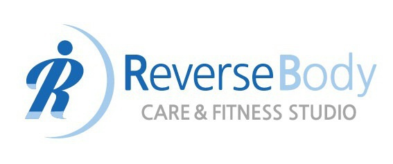
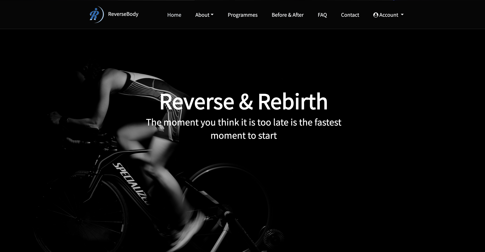
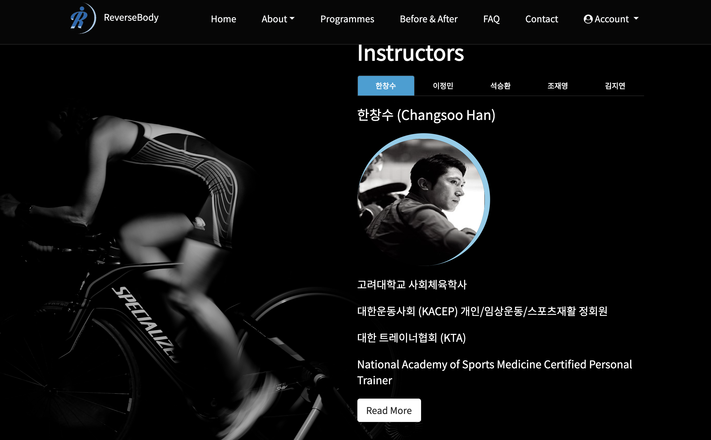
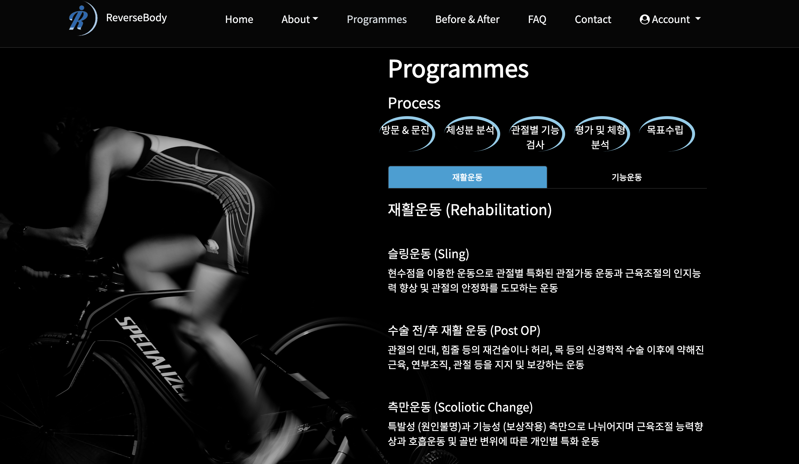

# ReverseBodyStudio

Intro video of the app: https://www.youtube.com/watch?v=reV-o3p8lZs&t=22s

Designed and Developed by Allen Cho.

- Techniques used in this app
    - C#, ASP.NET Core Web API
    - Angular 6
    - External Maps API (Waze)
    - Bootstrap
    - HTML
    - Responsiveness (CSS Media Queries and Tweeter Bootstrap)
    - Angular Bootstrap (ngx-bootstrap)
    - Cloudinary (3rd party cloud photo management library)

- Functionalities
    - Basic information about the centre
    - Register and login
    - User Management system
        - Admin
            - Assign roles to users (instructor, and client)
            - Assign clients to an instructor
            - Delete users
        - Instructor
            - Add rehabilitation programmes and symptoms for assigned clients
        - Client
            - Check status (programmes, symptoms, and photos of themselves changed through ongoing rehabilitiations - before & after)
            - Edit profiles

- Main page

- Instructor page

- Programmes page

